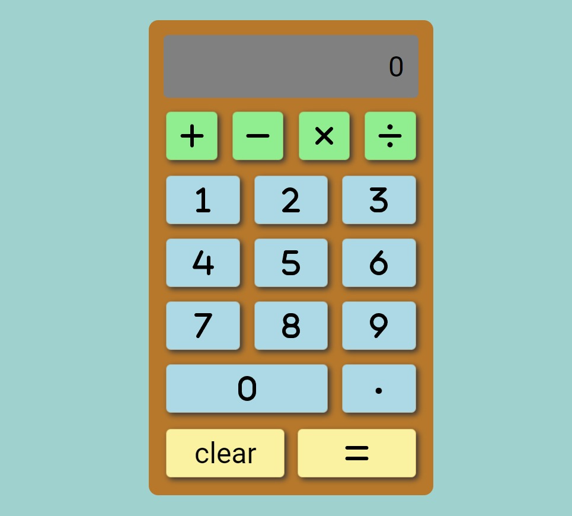

# Calculator

Table of content

  
## Table of Content
- [Summary](#summary)
- [Technologies](#technologies)
- [Instructions](#instructions)
- [Updates](#updates)
- [Live Site](#live-site)  
- [Status](#status)
- [License](#license)

## Summary

A calculator web app 
A project built as part of the **Front End Development Libraries** course by **freeCodeCamp**

## Technologies

 

This project is built with **React** using [Vite](https://vitejs.dev/) and written in **Typescript** and **Sass.**

---

---

## Instructions

- Operated by mouse clicks
  
## Updates

### Ideas:
- Add keypress activation (currently it's just mouse clicks)
- Add sounds and or animation for the button clicks
- Add additional calculator functionality and controls - e.g. square root, squared

## Live Site

This project is [deployed on Netlify](https://mikalculator.netlify.app/)

## Status

## License

This project is licensed under the terms of the BSD 3-clause "New" or "Revised" license.

 

